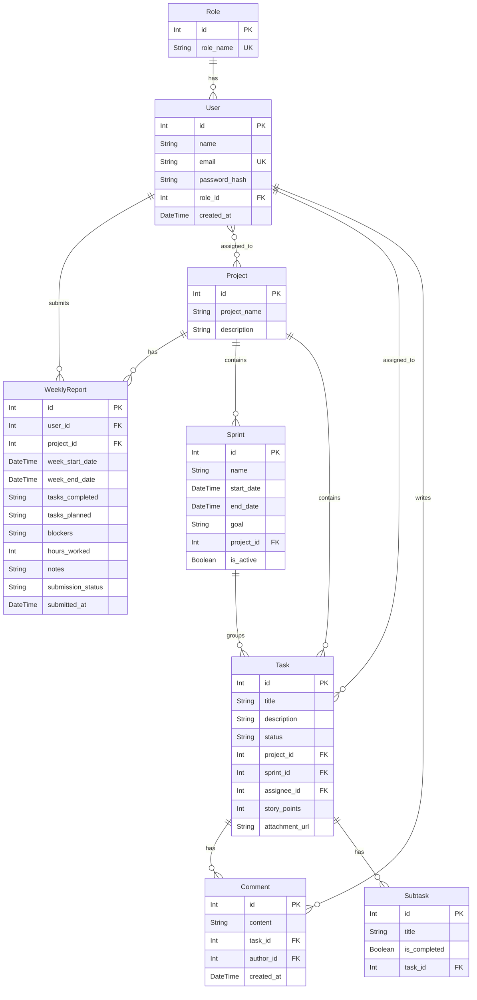

# Entity Relationship Diagram (ERD)

This diagram outlines the database architecture for the Project and Team Task Management Platform.

```mermaid
erDiagram
    Role ||--o{ User : has
    User ||--o{ WeeklyReport : submits
    User }o--o{ Project : assigned_to
    User ||--o{ Task : assigned_to
    User ||--o{ Comment : writes
    Project ||--o{ WeeklyReport : has
    Project ||--o{ Sprint : contains
    Project ||--o{ Task : contains
    Sprint ||--o{ Task : groups
    Task ||--o{ Comment : has
    Task ||--o{ Subtask : has

    Role {
        Int id PK
        String role_name UK
    }

    User {
        Int id PK
        String name
        String email UK
        String password_hash
        Int role_id FK
        DateTime created_at
    }

    Project {
        Int id PK
        String project_name
        String description
    }

    WeeklyReport {
        Int id PK
        Int user_id FK
        Int project_id FK
        DateTime week_start_date
        DateTime week_end_date
        String tasks_completed
        String tasks_planned
        String blockers
        Int hours_worked
        String notes
        String submission_status
        DateTime submitted_at
    }

    Sprint {
        Int id PK
        String name
        DateTime start_date
        DateTime end_date
        String goal
        Int project_id FK
        Boolean is_active
    }

    Task {
        Int id PK
        String title
        String description
        String status
        Int project_id FK
        Int sprint_id FK
        Int assignee_id FK
        Int story_points
        String attachment_url
    }

    Comment {
        Int id PK
        String content
        Int task_id FK
        Int author_id FK
        DateTime created_at
    }

    Subtask {
        Int id PK
        String title
        Boolean is_completed
        Int task_id FK
    }
```
