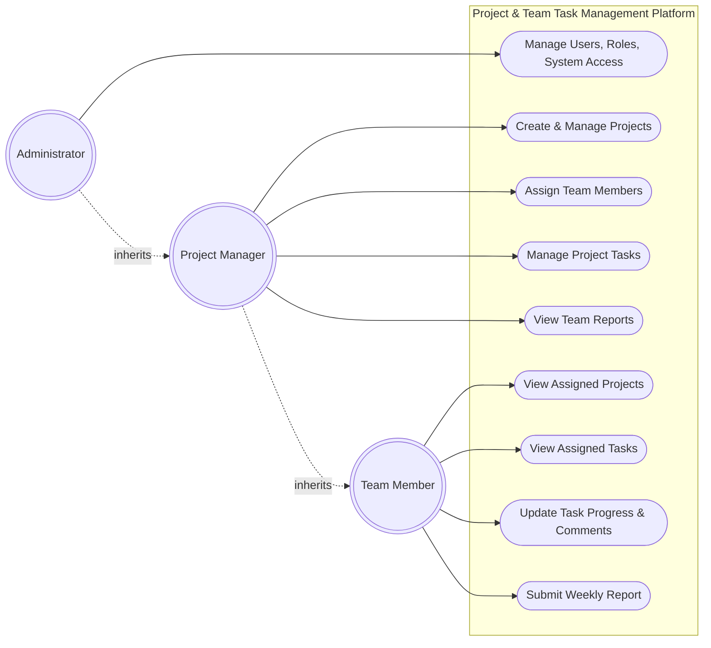

# Use Case Diagram

This diagram outlines the interactions between the system's actors and their available use cases based on Role-Based Access Control (RBAC).

```mermaid
flowchart LR
    %% Actors
    Admin(((Administrator)))
    PM(((Project Manager)))
    TM(((Team Member)))

    %% Inheritance
    Admin -.->|inherits| PM
    PM -.->|inherits| TM

    %% Use Cases
    subgraph System ["Project & Team Task Management Platform"]
        UC1([Manage Users, Roles, System Access])
        UC2([Create & Manage Projects])
        UC3([Assign Team Members])
        UC4([Manage Project Tasks])
        UC5([View Team Reports])
        UC6([View Assigned Projects])
        UC7([View Assigned Tasks])
        UC8([Update Task Progress & Comments])
        UC9([Submit Weekly Report])
    end

    %% Administrator exclusive use cases
    Admin --> UC1

    %% Project Manager use cases
    PM --> UC2
    PM --> UC3
    PM --> UC4
    PM --> UC5

    %% Team Member use cases
    TM --> UC6
    TM --> UC7
    TM --> UC8
    TM --> UC9
```
